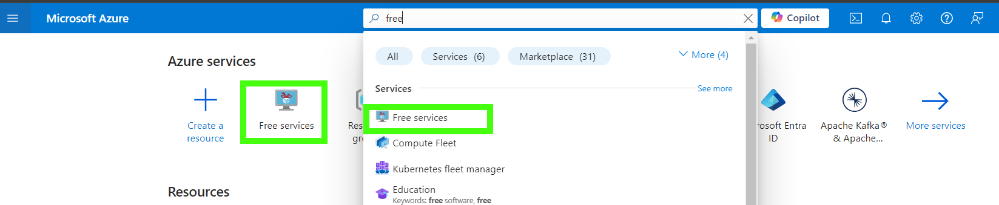
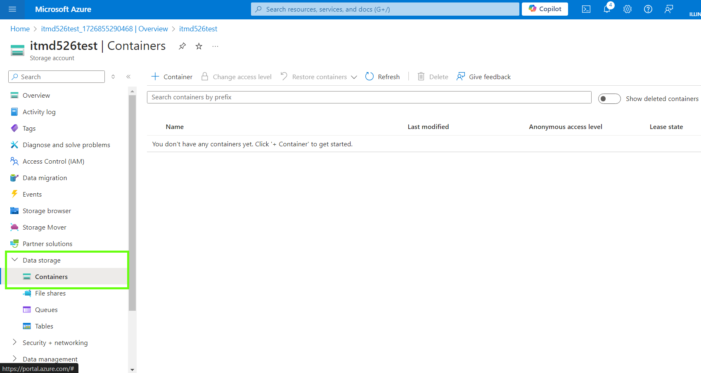
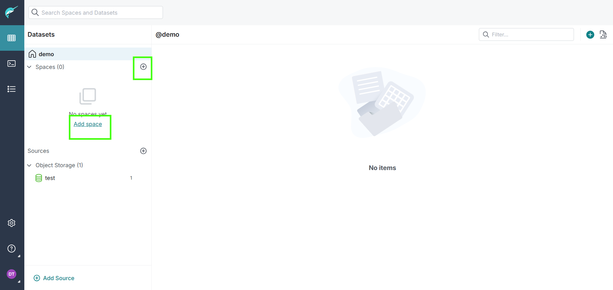

# Creating Azure Blob

## Create an Azure Account

You can create a free Azure account by going to the [Azure website](https://azure.microsoft.com/en-us/free/students) with the university email. This is sufficient as of now.
> **Note:** You don't have to provide any payment information to sign up with Azure for students, but the account created is not a full azure account. Even with credits this account may not be qualified for all azure services which require a payment method. 

## Creating a Blob

Follow below steps to create a blob Storage

1. Click on `Free Services` on Homepage or type free services in search.

    

2. Under Azure Blob Storage click on `Create`.

    

3. Select Subscription `Azure for Students` if not selected. Under the `resource group` section, click on `Create new` give it a name and then click on `ok`. **If you don't see the Subscription *Azure for Students* please log out and login (or) wait a couple of minutes and then relogin.**

    

4. Provide a storage account name **this must be unique** and then click on `Review + Create`.

    

5. Check all the details and click on `Create`.

    

6. After it's deployed click on `Go to resource`.

    

## Creating a Container

1. Go to `Data Storage` tab and click on `Containers`.

    

2. Click on `+ Container`, give it a name and then click on `Create`.

    
 
## Uploading Files to the Blob

1. Go to `Overview` tab and click on `Upload`.

    

2. Click on `Browse for files` and select the files that should be uploaded. In the drop-down menu of `Select an existing container` select the container that was created earlier and then click on upload.

    

3. Take a note of `Storage account name` and one of the accesskey. These are required to connect to dremio in the next section.
    
    

# Connecting to Dremio

1. Click on add sources and select `Azure Storage`

    

    

2. Enter the name you  would like to display under `Name` and the `Account Name` is the storage account name in this case it will be `itmd526test` (derived from the previous section). The `Account Version ` is `Storagev1` and the `Authentication Type` is `Shared access key`. Paste the key value under `Secret Store` that was copied in the previous section and then click `Save`
    
    

3. All the containers that are present in the storage account will be shown here you can access the objects inside the container as a folder.

    
    

4. In order for the file to be access by the `SQL Runner` we need to first specify the `Format` and `Extract Column Names` if any by opening the file in the container. Click `Save` the file will be automatically opened in `SQL Runner`.

    

6. Go to the `Datasets` pane (first one in far left menu) and click on `Add Space`. Give it the `Name` `Bronze` and `Save`.

    
    

7. Click on `Run` to get the output and `Save View`
     
    

8. Give a `Name` for the view and save it under `Bronze` Space.

    
    