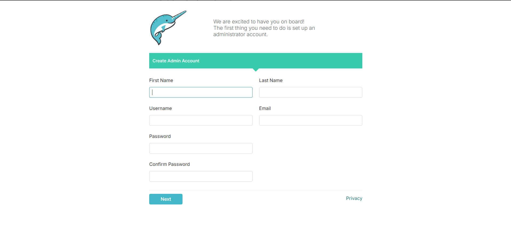

# Dremio on Docker


* Install Docker Desktop from this [link](https://www.docker.com/products/docker-desktop/).

* After completing the installation open docker desktop and complete the initial setup.

* After completing the intial seyup on docker destop UI. Open terminal and in the terminal pull the dremio docker image. **Run this only once**.

    ```
    docker pull dremio/dremio-oss
    ```
* Deploy the docker image from the terminal.
    ```
    docker run -p 9047:9047 -p 31010:31010 -p 32010:32010 -p 45678:45678 dremio/dremio-oss
    ```
* Open `localhost:9047` in a browser to access dremio.

>**Note**: You can also use Docker Desktop to deploy the image. Once you pulled the image and deployed it from the terminal, it will be showed under container section in Docker desktop UI.

# Setup

* Fill the below form with your details and click `Next`.

    


