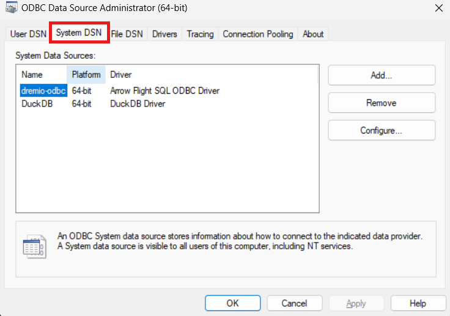
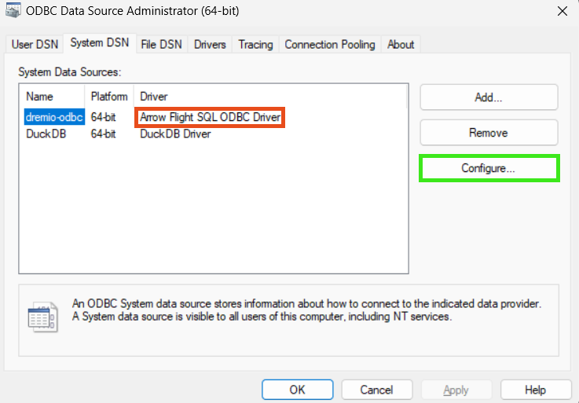
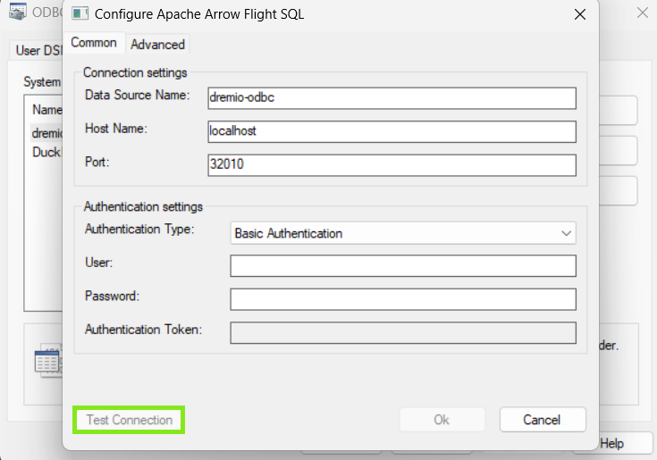
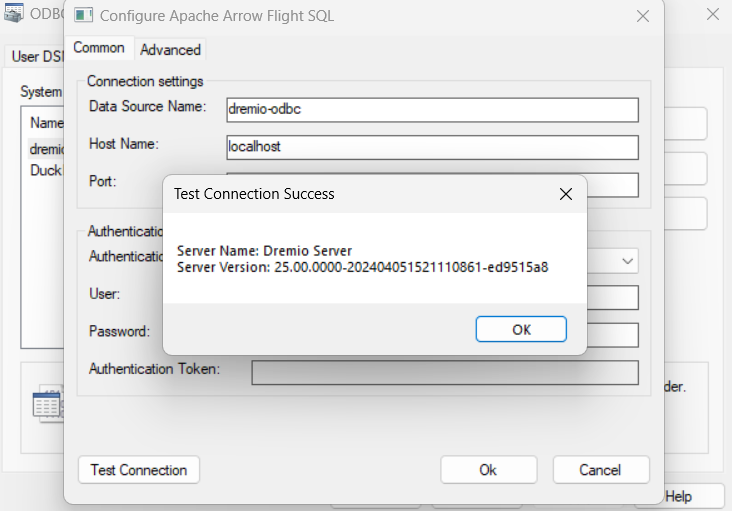

# Connect Dremio to Notbook with ODBC

## Download Dremio ODBC driver

Head to this [link](https://www.dremio.com/drivers/odbc/) to download the Dremio ODBC driver for your platform.

>**Note**: For linux users Dremio only supports Red Hat based distro's.However, you can download the provided RPM package and use [alien](https://wiki.debian.org/Alien) to convert it to debian. 

## Installing Dremio ODBC Driver 
### Windows
1. Install the Dremio ODBC driver on your Windows machine that you downloaded earlier.
2. In the Welcome to Dremio page, click Next.
3. Click Install.
4. In the Installation Complete page, click Next.
5. In the Completing Arrow Flight SQL ODBC Driver Setup Wizard page, click Finish.

### MacOS
1. Go to the download location and double-click the downloaded .dmg file.
2. Double-click the .pkg file.
3. In the Welcome to the ODBC Driver for Arrow Flight SQL Installer page, click Continue.
4. In the Standard Install on "Macintosh HD" page, Click Install. Optionally, if you want to change the install location, click Change Install Location and navigate to the new location.
5. In the Installer is trying to install new software dialog, specify your macOS password. Then, click Install Software.
6. After the installation is complete, click Close.

## Configuring Dremio ODBC Driver

### Windows
1. Go to Start Menu > Window Administrative Tools. Click ODBC Data Sources (64-bit) or Search for ODBC Data Sources.
2. In the ODBC Data Source Administrator (64-bit) dialog, click System DSN.

    

3. Select Arrow Flight SQL ODBC DSN and click Configure.
    
    
    > **Note**: Your Name might differ, it can modified inside the configure menu.
4. In the HOST field, specify the hostname of the server or its IP address.
5. In the PORT field, specify the port to use for connections from Arrow Flight SQL ODBC client applications, which is 32010 by default.
6. In the User field, specify the username to use when connecting to Dremio.
7. In the Password field, specify either a password or a personal access token.

    Below are the details for steps 4 to 7:

    

After entering all the required details, click on test connection. The ouput should look like this

### MacOS 

[Click here](https://docs.dremio.com/24.3.x/sonar/client-applications/drivers/arrow-flight-sql-odbc-driver/#configuring-on-macos) for MacOS configuration.

