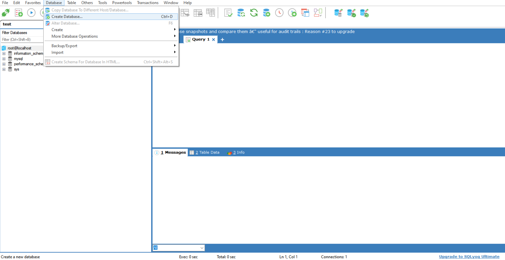
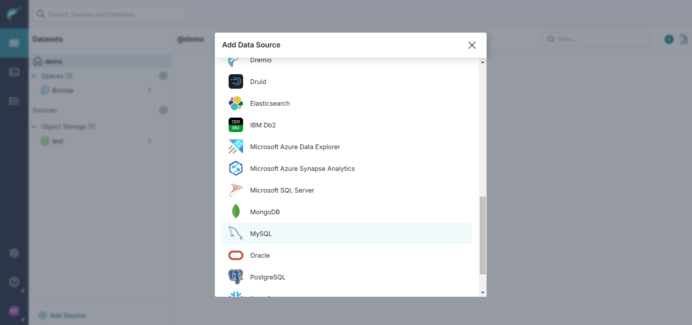
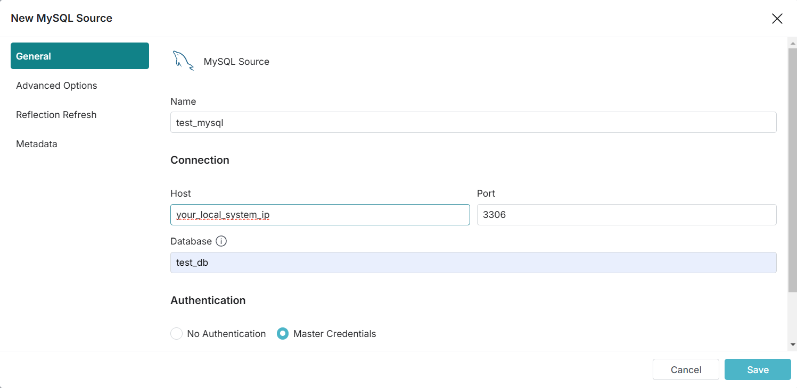
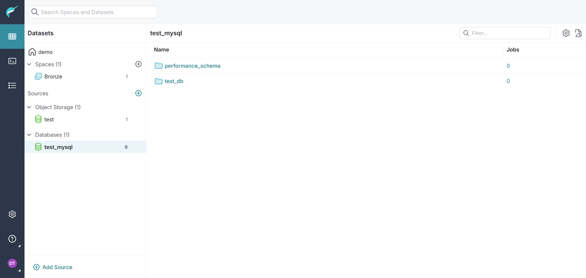

# Connecting Dremio to MYSQL

## Creating a DB and USER

1. Create a database (for demo we area creating test_db)

    

2. Creating a table and inserting values into it with the following queries

    ```sql
    CREATE TABLE demo_table(ID VARCHAR(10));

    INSERT INTO demo_table VALUES ('1');
    ```
3. Creating a user with access from all IP addresses and assigning all privilages. The `@'%'` represents access from all IPs. For demo purpose a sample password has been set, a strong password must be used in as we are providing access from all IPs.

    ```sql
    CREATE USER test_user@'%' IDENTIFIED BY 'test123'; 

    GRANT all on test_db.* to test_user@'%';
    ```

## Connecting DB to Dremio

1. Click on add sources `+` and select `MYSQL`
    
    

2. Give the details as follows. In the authentication section select `Master Credentails` and provide user name and password of the user you created earlier. In this case it's `test_user` and `test@123`.

    To find your system IP follow the links: 
    - [Windows](https://support.microsoft.com/en-us/windows/find-your-ip-address-in-windows-f21a9bbc-c582-55cd-35e0-73431160a1b9)
    - [MacOS](https://www.security.org/vpn/find-mac-ip-address/)

    

3. Click on Save and you should see the mysql db in the sources pane.

    **If you get an error while connecting please wait a while and then try connecting again. If you still couldn't connect try connecting to the Database with the user credentails instead of root from the SQL client and see if its working or not.**

    **If you create another table it might not show in the dremio instantly. To trigger it try running a query from the SQL runner in the dremio you should get the output and the new table should be now visible in under the DB source.**

    

