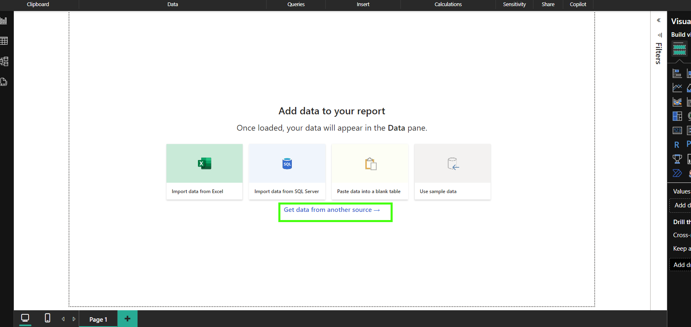
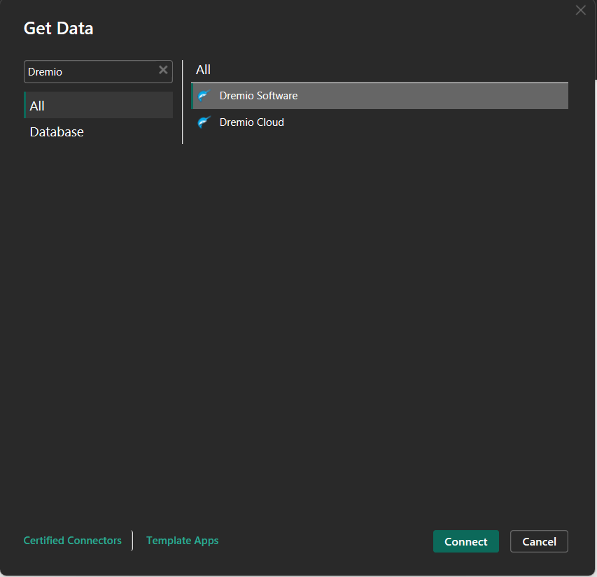
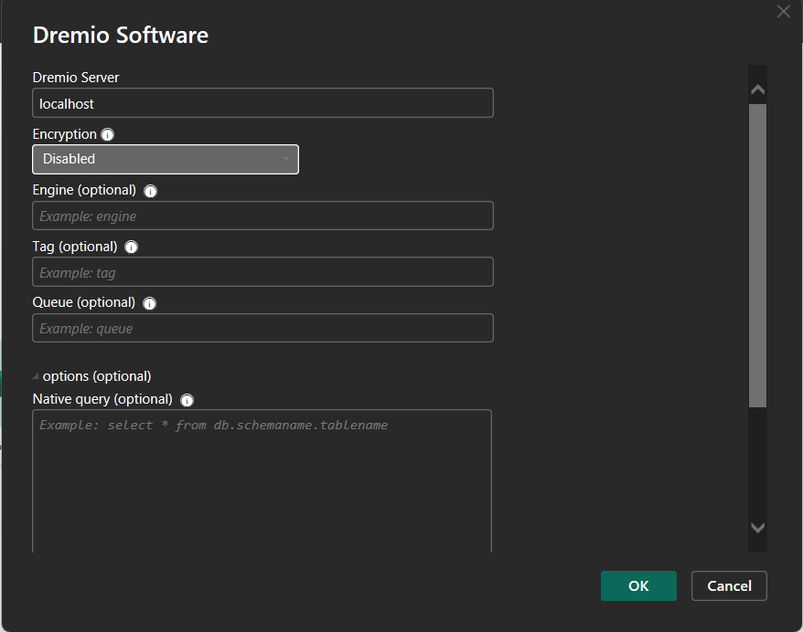
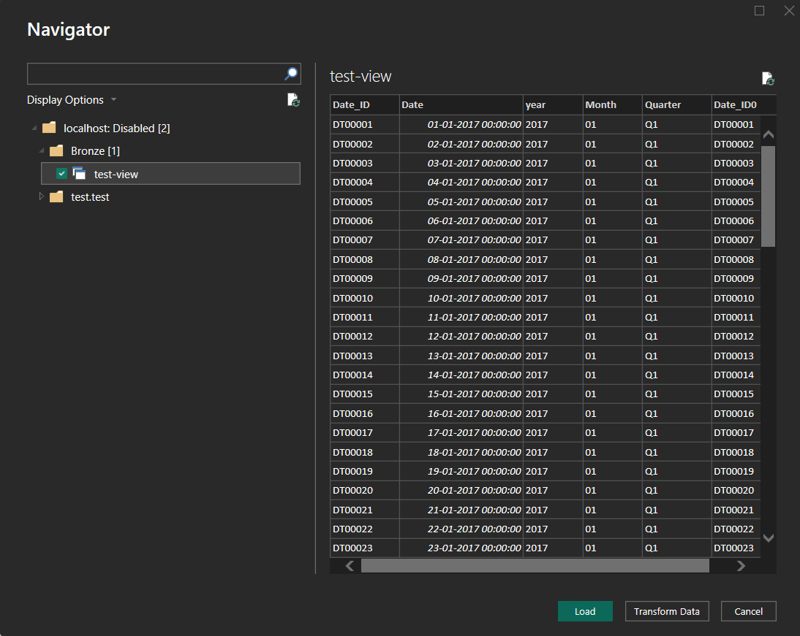
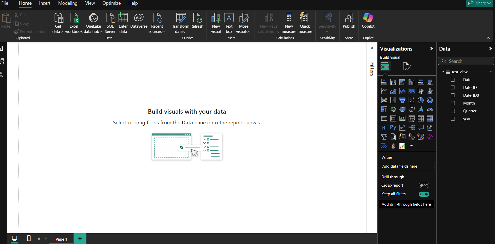

# Connecting Dremio to PowerBI

1. Create a `Blank Report` in PowerBI and click on `Get data from another source`.

    

2. In the `Get data` pane type dremio and select `Dremio Software` and click `Connect`.
     
     

3. Give the values as follows. If you scroll down there is another option of `Direct Query` under `Data Connectivity mode` this means the PowerBI will directly quer against Dremio instead of loading tables to the local system. Click `OK`.  

    

4. In the navigator you can see the `Bronze` Space that was created in dremio and the view saved under it. Select the view and click on `Load`.

    

5. Your view is now loaded into powerBI, the same can be seen under `Data`.

    